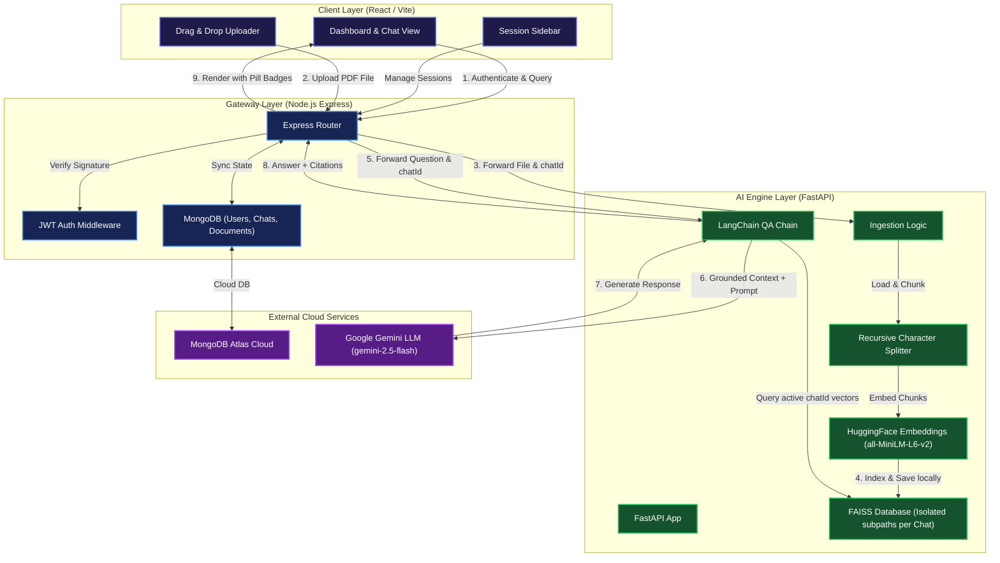

# 🤖 Company Knowledge RAG Chatbot

[](https://company-rag-chatbot-beta.vercel.app)

An enterprise-grade, multi-session **Retrieval-Augmented Generation (RAG)** chatbot. Every user has their own workspace, and every chat session has a fully **isolated vector database** partitioned dynamically by chat session ID. Users can upload their own PDFs to a chat session, and the system answers questions grounded strictly in the context of the uploaded files, providing precise page-level citations.

---

## 🏗️ System Architecture

The application is built on a decoupled, three-tier microservice architecture:
- **Vite React Frontend**: A responsive, premium dark-themed interface utilizing glassmorphism and real-time state sync.
- **Node.js Express Backend**: The API gateway managing user authentication, sessions, MongoDB CRUD states, and document upload forwarding.
- **Python FastAPI Service**: The AI core powering document chunking, HuggingFace embeddings generation, FAISS vector indexing, and LangChain QA chains using Google Gemini.



---

## 🌟 Key Features

- **Isolated Vector Workspaces**: Vector indexes are partitioned by Chat Session ID (`vectors/<chatId>/index.faiss`). A user can only query documents uploaded directly to the active chat session, ensuring absolute data isolation.
- **Zero Pre-loaded Data Restriction**: Conversations start as completely empty, document-locked spaces. The chat input bar is disabled until the user uploads their reference document.
- **Detailed Page-Level Citations**: When answering, the AI provides clickable source tags showing the original PDF file name and the exact page number(s) where the grounding facts were retrieved.
- **Premium User Interface**: Includes a responsive left sidebar, clean messaging bubbles, bouncing thinking indicator loops, modern drag-and-drop card inputs, and custom thin scrollbars.
- **User Authentication**: Secure signup and login flow powered by Node.js, `bcryptjs` password hashing, and signed JWT authentication headers.

---

## 🛠️ Technological Stack

### Frontend
- **React 19** & **Vite**
- **Tailwind CSS v4** (Utility styles)
- **React Icons** (Cloud upload, chat bubbles, trash states)
- **Axios** (API requests with authorization interceptors)

### Express Backend
- **Node.js** & **Express 5**
- **MongoDB** & **Mongoose** (Data schemas and modeling)
- **Multer** (File uploading middleware)
- **Form-Data** (Forwarding file buffers to the Python API)

### Python AI Core
- **FastAPI** & **Uvicorn**
- **LangChain** (QA chains and retrievers)
- **FAISS** (Local vector database indexing)
- **HuggingFace Transformers** (`sentence-transformers/all-MiniLM-L6-v2` embedding model)
- **Google Gemini API** (`gemini-2.5-flash` model for synthesis)

---

## 📂 Project Directory Structure

```
company-rag-chatbot/
│
├── backend/                       # Node.js API Gateway
│   ├── config/                    # DB connection setups
│   ├── controllers/               # Auth, Chat, Document business logic
│   ├── middleware/                # JWT protector, Multer upload config
│   ├── models/                    # Mongoose Models (User, Chat, Document)
│   ├── routes/                    # API Routing (/api/auth, /api/chat, /api/documents)
│   ├── uploads/                   # Local temp PDF uploads folder
│   ├── server.js                  # App bootstrap
│   └── .env                       # Backend Environment variables
│
├── client/                        # React Frontend
│   ├── src/
│   │   ├── components/            # ChatBox, Sidebar, UploadCard, Message, Loader, Navbar
│   │   ├── context/               # AuthContext state provider
│   │   ├── pages/                 # Login, Register, Dashboard views
│   │   ├── services/              # Axios instance configurations
│   │   ├── App.jsx                # Router endpoints mapping
│   │   └── index.css              # Typography & modern glassmorphism styles
│   └── vite.config.js             # Vite tailwind setup
│
└── python-ai/                     # Python AI Service
    ├── rag/                       # RAG Pipeline modules
    │   ├── chain.py               # RAG QA execution logic
    │   ├── embeddings.py          # HuggingFace Embeddings load
    │   ├── ingest.py              # Ingest coordination
    │   ├── loader.py              # PyPDF Loader setup
    │   ├── prompt.py              # LLM system prompts
    │   ├── retriever.py           # FAISS index subpath loader
    │   └── vectorstore.py         # FAISS local partition creation
    │
    ├── uploads/                   # Ingested PDF uploads directory
    ├── vectors/                   # Chat-level subpath vector databases (<chatId>/index.faiss)
    ├── app.py                     # FastAPI entry point
    └── .env                       # Gemini API Key configuration
```

---

## 🚀 Setup & Run Instructions

### 1. Prerequisites
- **Node.js** (v18+)
- **Python** (v3.10+)
- **MongoDB Database** (MongoDB Atlas or Local instance)
- **Google Gemini API Key** (Get one from [Google AI Studio](https://aistudio.google.com/))

### 2. Python AI Service Setup
1. Navigate to the Python directory:
   ```bash
   cd python-ai
   ```
2. Create and activate a virtual environment:
   ```bash
   python -m venv venv
   # On Windows:
   .\venv\Scripts\activate
   # On macOS/Linux:
   source venv/bin/activate
   ```
3. Install dependencies:
   ```bash
   pip install fastapi uvicorn pydantic langchain langchain-community langchain-core langchain-google-genai sentence-transformers pypdf faiss-cpu python-dotenv python-multipart torch
   ```
4. Create a `.env` file in the `python-ai/` directory:
   ```env
   GEMINI_API_KEY=your_gemini_api_key_here
   ```
5. Start the FastAPI server:
   ```bash
   uvicorn app:app --port 8000 --reload
   ```

### 3. Node.js Backend Setup
1. Navigate to the Backend directory:
   ```bash
   cd ../backend
   ```
2. Install dependencies:
   ```bash
   npm install
   ```
3. Create a `.env` file in the `backend/` directory:
   ```env
   PORT=5000
   MONGO_URI=your_mongodb_connection_uri
   JWT_SECRET=your_jwt_secret_key
   PYTHON_API=http://localhost:8000
   ```
4. Start the backend developer server:
   ```bash
   npm run dev
   ```

### 4. Vite Frontend Setup
1. Navigate to the Client directory:
   ```bash
   cd ../client
   ```
2. Install dependencies:
   ```bash
   npm install
   ```
3. Start the Vite server:
   ```bash
   npm run dev
   ```
4. Open your browser and navigate to `http://localhost:5173/`.

---

## 🔒 Grounding & Prompt Rules

The AI is governed by strict system prompts. It behaves under the following constraints:
- It **only** answers questions based on the retrieved vector chunks of the document uploaded in that specific chat session.
- If the required facts are not available in the active document workspace, it returns: `"I couldn't find this information in the uploaded documents."`
- It is strictly forbidden from utilizing generic pre-trained knowledge to answer specific policy details.
